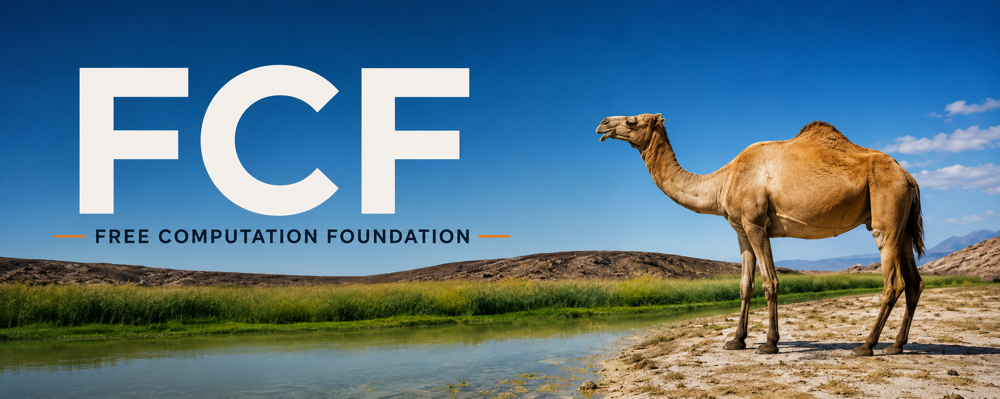
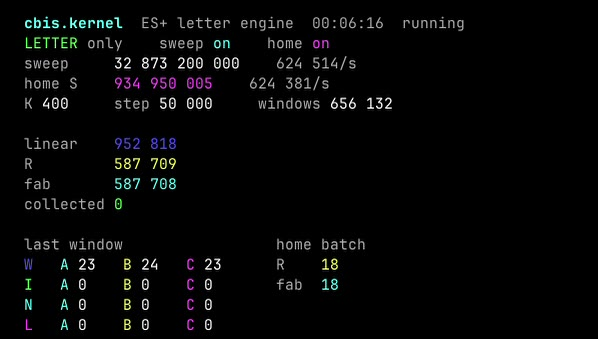

<p>
  
</p>

# CENTL

**Exact-first mathematics, physics, and scientific computation.**

*Good maths should be free.*  
*Never manufacture mathematical certainty.*

**CentL26** · [freecomputation.org](https://freecomputation.org/) · Apache-2.0

> **CentL26 is the single flagship product of CENTL.** The “26” identifies the
> product year. Every new capability and backend is prepared for this one
> cohesive CentL26 product; each published application build is an immutable
> release snapshot.

---

## What CENTL is

CENTL is a scientific computation system that refuses to pretend.

- Exact values stay exact. `0.1 + 0.2` is exactly `3/10`.
- Approximations always carry justified bounds.
- Unsupported work stays visible as residual expressions instead of being silently approximated or guessed.
- You can install only the surface you actually need.

```sh
centl '0.1 + 0.2'                 # → 3/10
centl 'approx(pi, 50)'            # justified digits only
centl-physics convert 100 cm m    # exact unit conversion
centl-sci                         # local scientific interpreter
cargo run --bin centl26           # standalone graphical scientific work environment
```

**CentL26** is the new standalone desktop product line: a calm, project-based
scientific IDE that composes CENTL capabilities behind one local execution
boundary. The product year is part of its name; maintenance updates publish
new immutable CentL26 build snapshots rather than creating separate product
editions or rewriting an existing release. It is
not part of the public website and it does not load the website
at runtime. See [the CentL26 architecture](docs/CENTL26-ARCHITECTURE.md) for the
desktop boundary, stable product identity, project model, capability broker, and
backend-unification plan. The former [CENTL Lab document](docs/CENTL-LAB.md) is
retained only as a migration record. The user-approved interface is protected
by the [CentL26 design contract](docs/CENTL26-DESIGN-CONTRACT.md); backend work
cannot silently alter its visual sources or defining layout invariants.

On macOS, build the actual standalone application bundle with:

```sh
./scripts/build-centl26-macos
open build/centl26/macos/CentL26.app
```

This produces one locally signed `CentL26.app` containing its native AppKit /
WebKit window and dedicated `centl26` computation service. The local host is an
internal implementation boundary owned by the application; users do not need
to operate a browser or manage a URL. See the
[native packaging guide](desktop/centl26/macos/README.md) for build,
self-test, signing, and current release limits.

The status-bar **Update** control is handled by the native app. It checks the
repository for the newest qualified, immutable CentL26 snapshot and can install
and relaunch that build; it is not a shortcut to the GitHub website. Source
builds with ad-hoc signing remain clearly local development builds.

CentL26 now restores its default notebook across application restarts. Exact
chemistry formula and conservation work is available from the same command
surface:

```text
chem atoms Ca(OH)2
chem balance Fe + O2 -> Fe2O3
```

These chemistry operations execute through the authoritative `centl-chem`
machine protocol; the complete protocol evidence is retained in the local
project instead of being reconstructed by the interface.

---

## Install only what you need

You do **not** need the whole product.

| You want | Install |
| --- | --- |
| Pure formal mathematics | `centl` |
| Typed exact-first physics | `centl-physics` |
| Natural-language scientific interaction | `centl-sci` |
| Everything | full installer |

### GNU/Linux x86_64 (recommended)

```sh
# Single component
curl -fsSLO https://raw.githubusercontent.com/chasebryan/centl/main/install-component
sh install-component --component centl        # or physics / sci

# Full product
curl -fsSLO https://raw.githubusercontent.com/chasebryan/centl/oasis/install
sh install
```

### macOS & Windows

Use the **CENTL-Marsa** harbor (current Camp software, not Oasis).  
See [docs/CENTL-MARSA.md](docs/CENTL-MARSA.md) or the field guides below.

---

## Field guides

| Field | Start here |
| --- | --- |
| Mathematics | **[Mathematician onboarding](docs/MATHEMATICIANS.md)** |
| Physics | **[Physicist onboarding](docs/PHYSICISTS.md)** |

Both guides cover all three platforms and begin with the smallest useful install.

---

## Current lines

| Line | What it is |
| --- | --- |
| [`CentL26`](docs/CENTL26-ARCHITECTURE.md) | **Flagship standalone scientific IDE and main 2026 release (26.0.0)** |
| [`oasis`](https://github.com/chasebryan/centl/tree/oasis) | Qualified stable product (v0.15.0 Al-Nur) |
| [`main`](https://github.com/chasebryan/centl/tree/main) | Current Camp stay + developer distribution |
| [`mirage`](https://github.com/chasebryan/centl/tree/mirage) | Laboratory |
| [`CENTL-Marsa`](https://github.com/chasebryan/centl/tree/CENTL-Marsa) | macOS / Windows harbor of the Camp stay |

A Camp is a stay. It is not an Oasis.  
Details: [Oasis](docs/OASIS.md) · [CENTL Marsa](docs/CENTL-MARSA.md) · [FCF Camps](docs/FCF-CAMPS.md)

---

## Research

The public research program is currently focused on **Erdős–Straus Type A/B witness depth and congruence shadow structure**.

### cbis.kernel — ES+ letter engine

**[cbis.kernel](research/erdos-straus/cbis.kernel/README.md)** (CB Inverse Sieve) is the ES+ production letter engine. One process, two walks, one cover. Sweep still starts at 0. Home walks only

`R = {hard p : p+4 and 4p+1 have only prime factors ≡ 1 (mod 4)}`

which is the only place a window-layer letter can sit.

[](https://freecomputation.org/assets/cbis-kernel-esp-demo.mp4)

The live color panel: sweep + R-homing, lanes W/I/N/L, spectra A/B/C. [Watch the demo (2:35, MP4)](https://freecomputation.org/assets/cbis-kernel-esp-demo.mp4) · [also on the research page](https://freecomputation.org/research-erdos-straus.html#cbis-demo)

```sh
make -C research/erdos-straus/cbis.kernel
./centl es cbis
./centl es cbis go --home-only
./centl es cbis letters
```

The letter spectrum is the complement of an inversely generated signed-box cover. The equation: [`research/erdos-straus/ES-plus/LETTER-EQUATION.md`](research/erdos-straus/ES-plus/LETTER-EQUATION.md).

### cbx.kernel — X-ray and inverse-cover research kernel

**[cbx.kernel](research/erdos-straus/cbx.kernel/README.md)** (CB X-ray Kernel) is deliberately separate from cbis. `cbis.kernel` remains the production letter hunt; CBX is the research instrument.

Its X-ray walk keeps the same mathematical cover order `W → I → N → L`, but evaluates hidden I/N/L lanes even when W already solved the prime. That turns buried first-hit geometry into data without weakening or reordering the production verdict.

CBX records an explicit finite search grade

`Γ = (F, K_I, E_N, A_L)`

instead of pretending the whole search is described by one scalar K. It uses exact 64-bit primality/factorization, signal-atomic target evaluation, immutable named grades, deterministic finite census runs, crash-tail repair, and an analyzer that mechanically tries to falsify candidate adaptive-K laws.

CBX also implements the true finite Lane-I inverse orientation

`k → C → p = 4C-k`

by enumerating the six hard-compatible `C mod 210` classes for each admissible shift, evaluating `δ_k(C)` first, and only then mapping generated hits back into the hard-prime universe. `--verify` cross-checks cover membership and the minimal first `k` against the p-first recognizer.

Fedora-family GNU/Linux is the primary CBX platform baseline; Ubuntu is a secondary Linux portability check. macOS and Windows do not drive this research kernel.

```sh
make -C research/erdos-straus/cbx.kernel

# X-ray path
./centl es cbx self-test
./centl es cbx probe 2521
./centl es cbx go --run deep-I --i-max 2000
python3 research/erdos-straus/cbx.kernel/analyze.py --run deep-I

# Constructive inverse Lane-I path
./centl es cbx inverse --hi 1000000 --i-max 400
./centl es cbx inverse --hi 100000 --i-max 80 --verify
```

Start with the [K/search-grade audit](research/erdos-straus/ES-plus/CBIS-K-PARAMETER-STATUS.md), the [CBX implementation status](research/erdos-straus/ES-plus/CBX-IMPLEMENTATION-STATUS.md), and the [first clean CBX X-ray census](research/erdos-straus/ES-plus/CBX-INITIAL-XRAY-CENSUS.md). The observed finite Lane-I record in that census is `k_I*=107`; it is **not** a universal bound.

### CBAP.kernel — letter targeting

**[cbap.kernel](research/erdos-straus/cbap.kernel/README.md)** (CB-Advanced-Processing) is the letter-only C engine. Three CRT spectra feed channels A/B/C; channel D sets `LETTER = TRUE` or drops the prime. GREAT is not stored.

```sh
make -C research/erdos-straus/cbap.kernel
./centl es cbap
./centl es cbap go --random
./centl es cbap letters
```

A finished hunt is not a proof of the conjecture.  
Public library (static HTML, no JavaScript): [freecomputation.org/research.html](https://freecomputation.org/research.html)

---

## Documentation

| Document | When |
| --- | --- |
| [Mathematician onboarding](docs/MATHEMATICIANS.md) | Mathematics |
| [Physicist onboarding](docs/PHYSICISTS.md) | Physics |
| [Installation](docs/INSTALL.md) | Full install details |
| [Numerical contract](docs/NUMERICS.md) | Exactness rules |
| [Documentation index](docs/README.md) | Everything else |
| [Contributing](CONTRIBUTING.md) | How to send work |
| [Security](SECURITY.md) | How to report problems |

---


## License

Software is **Apache-2.0**.  
Documentation is **CC BY 4.0** where identified.  
Branding is separate: [LICENSING.md](LICENSING.md).

Developed under the **Free Computation Foundation**.

**Free for science.**
