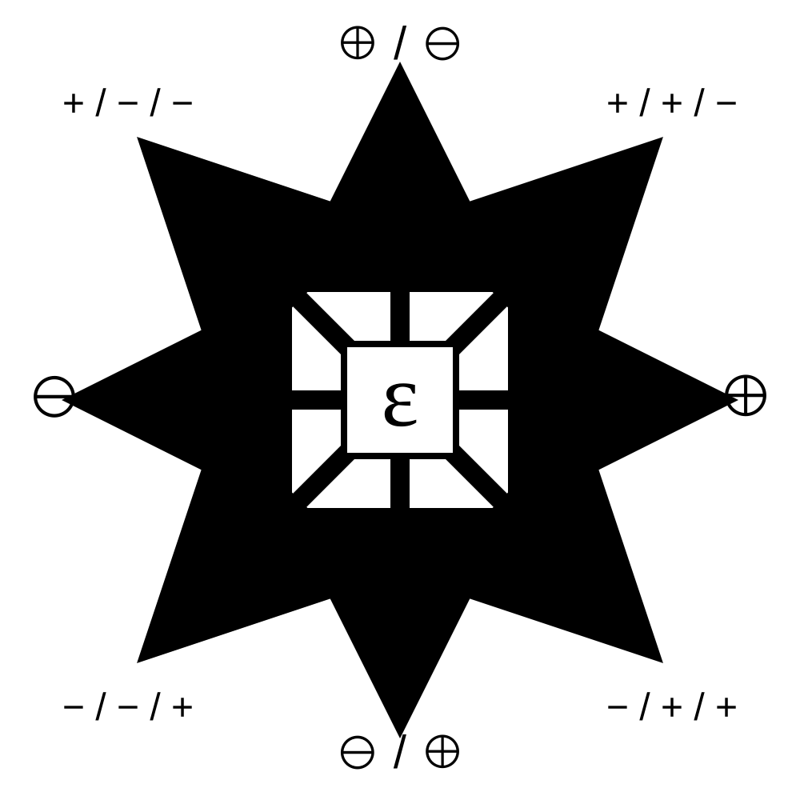

# Bryan Entanglement Compass

**Status:** operational second-order directional grammar derived from the Bryan Entanglement Cross  
**Date:** 2026-08-16  
**Authorial name:** Bryan Entanglement Compass  
**Abbreviation:** `BEC-C`  
**Parent object:** `BRYAN-ENTANGLEMENT-CROSS.md`  
**Primary use:** composite directional assumption schemes, CBX research-state visualization, and second-order telemetry  
**Claim boundary:** the Bryan Entanglement Compass is not an independent number-theoretic theorem, proof rule, pruning theorem, progress theorem, or substitute for exact arithmetic. Its diagonal signatures summarize a proved composite directional effect. They do not create one.



---

## 1. Cross first, Compass second

The Bryan Entanglement Cross is the primitive four-direction grammar:

```text
L = ←⊖          obstructive propagation
R = →⊕          constructive propagation
U = ↑(⊕/⊖)      constructive expansion with possible later obstruction
D = ↓(⊖/⊕)      restrictive excavation with possible later construction
```

The Bryan Entanglement Compass preserves those four cardinal directions and adds four diagonals.

The relationship is

```text
Cross    = primitive cardinal grammar
Compass  = Cross + composed diagonal grammar
```

The Compass therefore does **not** replace the Cross. It is its second-order extension.

---

## 2. The eight-direction object

Let `E` be an entanglement state. The Compass contains the four cardinal directions plus four composite diagonal directions:

```text
                         U
                      ⊕ / ⊖

            UL +/−/−             UR +/+/−
                  \               /
                   \             /
            L ⊖  ←     [ E ]     →  ⊕ R
                   /             \
                  /               \
            DL −/−/+             DR −/+/+

                      ⊖ / ⊕
                         D
```

The directional alphabet is

\[
\mathcal C_B(E)
=
\{L,R,U,D,UL,UR,DL,DR\}.
\]

The cardinal directions retain the semantics of the Bryan Entanglement Cross.

The diagonal directions carry **three-stage sign schemes**.

---

## 3. Why the diagonals have three signs

The diagonal signature is not an arbitrary string of pluses and minuses.

Each diagonal composes:

1. the **vertical onset** of `U` or `D`;
2. the **horizontal bias** of `L` or `R`;
3. the **vertical consequence/resolution** of `U` or `D`.

Write

```text
vertical word U = (+, −)
vertical word D = (−, +)

horizontal bias L = −
horizontal bias R = +
```

Define the diagonal composition operator

\[
(v_1,v_2)\otimes h := (v_1,h,v_2).
\]

Then the four diagonal signatures are forced:

\[
\boxed{U\otimes L=(+,-,-)}
\]

\[
\boxed{U\otimes R=(+,+,-)}
\]

\[
\boxed{D\otimes L=(-,-,+)}
\]

\[
\boxed{D\otimes R=(-,+,+)}.
\]

Equivalently:

```text
UL = + / − / −
UR = + / + / −
DL = − / − / +
DR = − / + / +
```

This is the governing diagonal assumption scheme for BEC-C.

---

## 4. Semantic reading of the diagonal signatures

The three positions have fixed meanings:

```text
(first, second, third)
 =
(vertical onset, horizontal bias, vertical consequence/resolution)
```

### 4.1 Upper-left: `UL = + / − / −`

A constructive expansion begins, but it is left-biased toward obstruction and ends with the obstructive consequence already latent in the upward `+/−` direction.

Working reading:

```text
constructive opening
    -> obstructive bias
        -> obstructive consequence
```

### 4.2 Upper-right: `UR = + / + / −`

A constructive expansion begins, is reinforced by constructive horizontal pressure, but still carries the possible obstructive consequence of the upward direction.

Working reading:

```text
constructive opening
    -> constructive bias
        -> possible obstructive consequence
```

### 4.3 Lower-left: `DL = − / − / +`

A restrictive excavation begins, is reinforced by obstructive horizontal pressure, but retains the constructive resolution inherent in the downward `−/+` direction.

Working reading:

```text
restrictive opening
    -> obstructive bias
        -> constructive resolution
```

### 4.4 Lower-right: `DR = − / + / +`

A restrictive excavation begins, then acquires constructive horizontal pressure and resolves constructively.

Working reading:

```text
restrictive opening
    -> constructive bias
        -> constructive resolution
```

These are directional assumption schemes, not arithmetic products of signs.

---

## 5. Symmetry laws

The four diagonal signatures have useful exact symmetries at the grammar level.

### Horizontal reflection

Reflecting left to right flips only the horizontal-bias slot:

```text
UL +−−  <->  UR ++−
DL −−+  <->  DR −++
```

### Vertical reflection

Reflecting up to down replaces the upward vertical word `(+,-)` by the downward word `(-,+)`:

```text
UL +−−  <->  DL −−+
UR ++−  <->  DR −++
```

### Central inversion

A 180-degree inversion flips all three signs:

```text
UL +−−  <->  DR −++
UR ++−  <->  DL −−+
```

These symmetries are one reason to preserve the particular four-signature arrangement rather than assigning diagonal strings ad hoc.

---

## 6. Cardinal versus diagonal use

A Compass diagonal should be assigned only when the underlying exact transition genuinely has both:

- a vertical two-stage structure (`U` or `D`), and
- a horizontal constructive/obstructive bias (`R` or `L`).

If only one primitive direction is justified, use the original Cross direction.

Therefore:

```text
simple proved effect       -> Cross cardinal direction
proved composite effect    -> Compass diagonal direction
```

The diagonal is a refinement, not a replacement label.

A useful machine invariant is

```text
exact arithmetic
    -> exact ancestry
        -> proved primitive/composite effect
            -> Cross or Compass annotation
```

Never reverse this implication.

---

## 7. CBX integration

The Compass is adopted as part of the **CBX mathematical design language**.

CBX already operates as an X-ray instrument over hidden lane geometry and exact survivor transitions. The Cross supplies its primitive directional grammar; the Compass supplies a second-order grammar for states where two directional effects are simultaneously relevant.

The intended hierarchy is

```text
CBX arithmetic core
    -> exact lane / state transition
        -> Bryan Entanglement Cross cardinal annotation
            -> optional Bryan Entanglement Compass refinement
                -> telemetry / visualization / scheduler research
```

Recommended machine representation:

```text
bec = {
    scope: research-operation | live-ancestry,
    cardinal: L | R | U | D,
    history: ...,
    provenance: ...
}

bec_compass = {
    diagonal: UL | UR | DL | DR | null,
    signature: +-- | ++- | --+ | -++ | null,
    vertical_parent: U | D | null,
    horizontal_bias: L | R | null,
    provenance: ...
}
```

`bec_compass` is optional. A transition must not be forced into a diagonal category when its exact state does not justify the composition.

---

## 8. CBX design policy

The Compass is a mathematical emblem for CBX research-state navigation, not a replacement for FCF organizational identity.

Use the **Cross** when the visual or theorem narrative is about primitive direction:

- obstruction versus construction;
- expansion versus excavation;
- simple live BEC paths such as `L^jR`.

Use the **Compass** when the visual or theorem narrative is about composite pressure:

- a vertical transformation carrying a simultaneous left/right bias;
- scheduler maps over multi-effect states;
- composite survivor-state diagrams;
- CBX architecture art where the kernel is shown navigating a field rather than only taking one primitive transition.

The checked-in vector reference is

`assets/bryan-entanglement-compass.svg`.

Design constraints:

- eight equal rays;
- central entanglement state `ε`;
- cardinal Cross notation retained unchanged;
- diagonal signatures retained exactly as `+--`, `++-`, `--+`, `-++`;
- high-contrast black/white or single-color rendering preferred;
- no decorative element should obscure the mathematical labels.

---

## 9. Scheduler interpretation

The Compass can index composite scheduler hypotheses without changing proof semantics.

Examples:

```text
UL  expansion that is drifting obstructively
UR  expansion with constructive bias but unresolved future cost
DL  excavation under continued obstruction with a constructive escape channel
DR  excavation already biased toward constructive resolution
```

A finite scheduler may prioritize or compare these classes experimentally.

However:

```text
Compass direction != theorem
Compass direction != pruning permission
Compass direction != progress proof
Compass frequency != density theorem
```

The exact arithmetic state remains authoritative.

---

## 10. Relation to the active decomposition machine

The current post-k23 BEC transition work uses cardinal live paths such as

```text
R
LR
LLR
LLLR
...
```

Those paths remain cardinal because each live shift is presently classified as an exact miss (`L`) or exact construction (`R`).

The Compass becomes relevant when a theorem or scheduler state carries a simultaneous second-order effect, for example:

- an exact excavation of the residual state (`D`) whose new local geometry is already constructively biased (`R`), giving `DR = -++`;
- an exact expansion of the state geometry (`U`) whose new branch structure is obstructively biased (`L`), giving `UL = +--`.

This keeps the new object useful without rewriting existing BEC ancestry retroactively.

---

## 11. Compact formal definition

Let

\[
v(U)=(+,-),\qquad v(D)=(-,+),
\]

and

\[
h(L)=-,\qquad h(R)=+.
\]

For `V in {U,D}` and `H in {L,R}`, define

\[
\boxed{
\chi(V,H)=\big(v_1(V),h(H),v_2(V)\big).
}
\]

Then

\[
\boxed{
\begin{aligned}
\chi(U,L)&=(+,-,-),\\
\chi(U,R)&=(+,+,-),\\
\chi(D,L)&=(-,-,+),\\
\chi(D,R)&=(-,+,+).
\end{aligned}
}
\]

The Bryan Entanglement Compass is the Bryan Entanglement Cross together with these four derived diagonal states.

---

## 12. Research interpretation

The Cross answers:

> **In which primitive direction is the exact pressure acting?**

The Compass asks the second-order question:

> **When a vertical transformation is underway, is its lateral pressure constructive or obstructive, and what consequence does that transformation carry?**

That is the distinction to preserve.

The Cross is the grammar of direction.

The Compass is the grammar of **composed direction**.

Erdős–Straus remains open.
